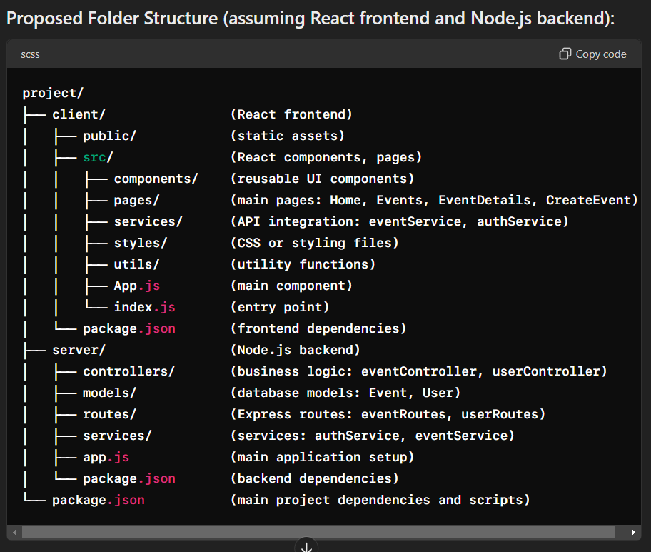

Great, thanks for the details! Based on your responses, here's a more detailed approach to building your event creation web app for a college environment:

### Project Requirements and Approach:

#### 1. User Roles
- **Admins**: Responsible for managing the overall system, user roles, and potentially overseeing all events.
- **Event Organizers**: Individuals or groups responsible for creating and managing specific events.
- **General Users**: Students or faculty members who browse, filter, and participate in events.

#### 2. Event Types
- **Cultural Events**: Concerts, performances, exhibitions.
- **Sports Events**: Tournaments, matches, recreational events.
- **Academic Events**: Workshops, seminars, conferences.
- **Social Events**: Mixers, networking events, parties.
- Each type may have specific attributes (e.g., equipment needed for sports events, topics for academic events).

#### 3. Sorting and Filters
- **Sorting Criteria**: Date/time, popularity (RSVP count), relevance.
- **Filters**: Event type, date range, location (on-campus/off-campus), organizer, popularity.

#### 4. Event Details Displayed
- **Basic Information**: Title, description, date/time, location.
- **Additional Details**: Organizer(s), participants, event type, RSVP count, comments/discussion section.
- **Actions**: RSVP, share event, add to calendar.

#### 5. Interaction Features
- **Event Creation**: Form for organizers to input event details, upload images, and set privacy settings.
- **Event Viewing**: Responsive UI to browse events with sorting and filtering options.
- **User Interactions**: RSVP to events, leave comments, share events on social media or via email.

### Proposed Folder Structure (assuming React frontend and Node.js backend):

```
project/
├── client/                (React frontend)
│   ├── public/            (static assets)
│   ├── src/               (React components, pages)
│   │   ├── components/    (reusable UI components)
│   │   ├── pages/         (main pages: Home, Events, EventDetails, CreateEvent)
│   │   ├── services/      (API integration: eventService, authService)
│   │   ├── styles/        (CSS or styling files)
│   │   ├── utils/         (utility functions)
│   │   ├── App.js         (main component)
│   │   └── index.js       (entry point)
│   └── package.json       (frontend dependencies)
├── server/                (Node.js backend)
│   ├── controllers/       (business logic: eventController, userController)
│   ├── models/            (database models: Event, User)
│   ├── routes/            (Express routes: eventRoutes, userRoutes)
│   ├── services/          (services: authService, eventService)
│   ├── app.js             (main application setup)
│   └── package.json       (backend dependencies)
└── package.json           (main project dependencies and scripts)
```

### Additional Considerations:

- **Authentication and Authorization**: Implement user authentication (e.g., JWT) to manage different roles and access permissions.
- **Database**: Choose a suitable database (e.g., MongoDB, PostgreSQL) for storing event data and user information.
- **API Design**: Define clear and secure APIs between frontend and backend for data exchange (RESTful or GraphQL).
- **User Experience**: Ensure the UI is intuitive, responsive, and accessible across devices (desktop, mobile).
- **Deployment**: Plan for deployment to a cloud platform (e.g., AWS, Heroku) considering scalability and performance.
- **Testing**: Implement unit testing for backend logic and UI testing for frontend components to ensure functionality and reliability.

This structured approach should help in efficiently developing and deploying your event creation web app, catering to the needs of admins, event organizers, and general users within a college community. Adjustments can be made based on specific preferences, technologies used, and additional requirements as the project progresses.


